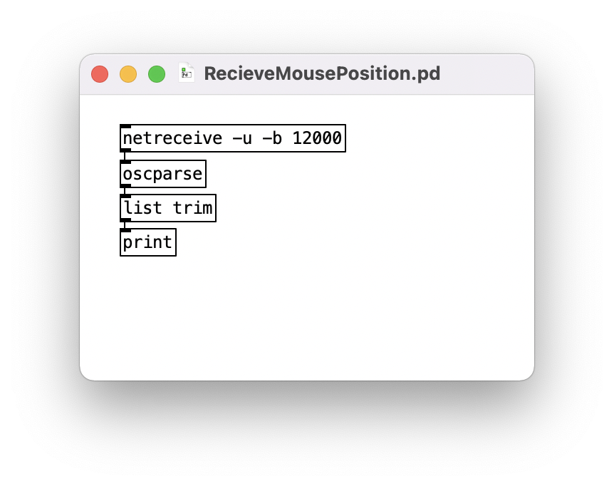
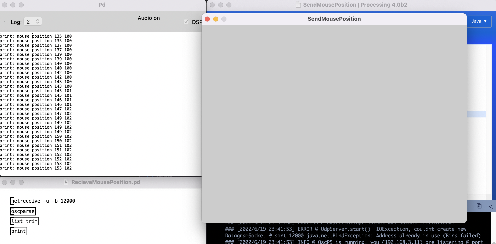
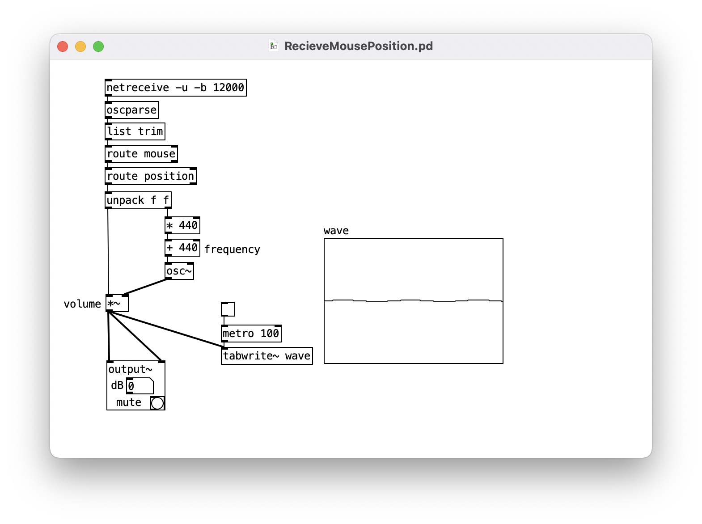
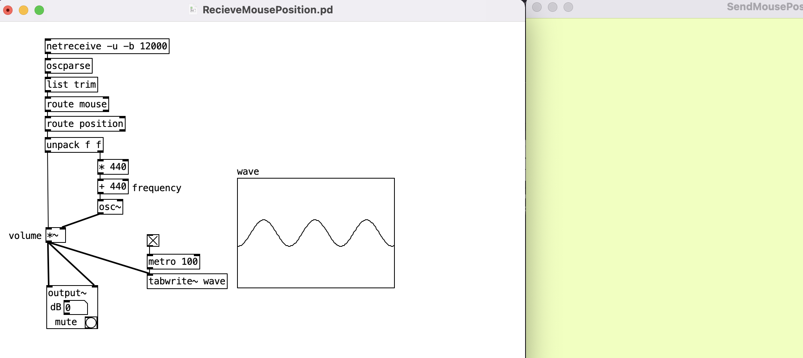
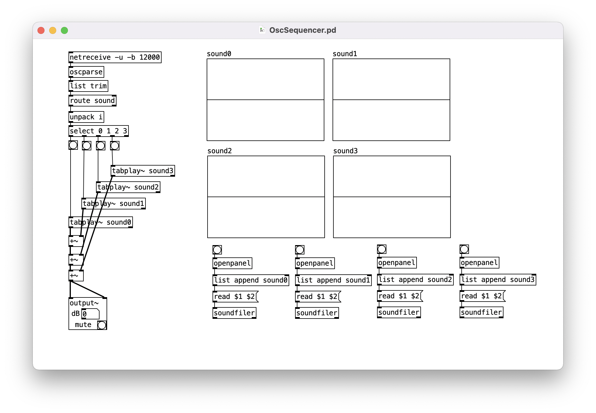
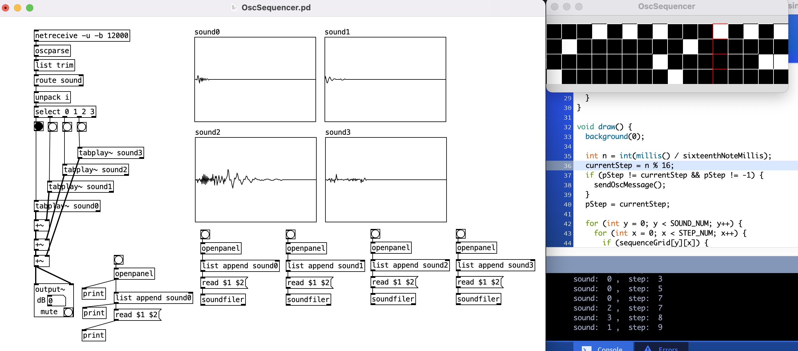

# Night session #2
## Pure DataとProcessingをOSCで繋ぐ

---

# OSCとは

- Open Sound Control
- MIDI(Musical Instrument Digital Interface)の代替となることを目的としている
    - 電子楽器の入力情報の送受信
    - 実際は用途は音楽に限らない
        - [FaceOSC](https://vimeo.com/26098366)
- https://ja.wikipedia.org/wiki/OpenSound_Control

---

# 今日やること

## OSCを使ってProcessingからPure Dataにデータを送信する

---

# どんなことができるようになるか

- Processingはグラフィックによる表現が得意
- Pure Dataは音による表現が得意

## グラフィックと音の連動ができるようになる！

- パーティクルの動きに合わせた音の生成
- 体の動きで音楽を演奏する
- etc.

---

# サンプルコード紹介

- ex1
    - マウスの座標を送受信する
- ex2
    - マウスの座標を送受信して音とグラフィックに反映する
- ex3
    - OSCシーケンサー
    - OSCが送られてきたら対応する音を鳴らす

---

# ex1
## マウスの座標を送受信する

- SendMousePosition (Processing)
    - マウス座標を送信するサンプル
- RecieveMousePosition.pd (Pure Data)
    - マウス座標を受信するサンプル

---

# ex2
## マウスの座標を送受信して音とグラフィックに反映する

- SendMousePosition (Processing)
    - マウスの座標を正規化（0 ~ 1にマッピング）してPdに送信する
    - マウスの座標で背景色を変化させる
        - X座標で彩度を変化させる
        - Y座標で色相を変化させる
- RecieveMousePosition.pd (Pure Data)
    - サイン波を鳴らす
        - X座標で音量を変化させる
        - Y座標で音高を変化させる

---

# ex3
## OSCシーケンサー

- OscSequencer (Processing)
    - マウスで操作可能なトグルスイッチをグリッド状に配置する
        - x軸に時間
        - y軸に音の種類
    - トグルスイッチがONになっていたら、一定時間毎にOSCを送信する
- OscSequencer.pd (Pure Data)
    - 4種類のサウンドファイルをファイルロードする
    - OSCが送られてきたら、対応する音を再生する

---

# ex1

---

# Processing

```java
import oscP5.*;
import netP5.*;

OscP5 oscP5;
NetAddress pdAddress;

void setup() {
    size(640, 480);
    oscP5 = new OscP5(this, 12000);
    pdAddress = new NetAddress("127.0.0.1", 12000);
}

void draw() {
}

void mouseMoved() {
    OscMessage mousePositionMessage = new OscMessage("/mouse/position");
    mousePositionMessage.add(mouseX);
    mousePositionMessage.add(mouseY);
    oscP5.send(mousePositionMessage, pdAddress);
}
```

---

```java
// ライブラリをインポート
import oscP5.*;
import netP5.*;

// OSCを扱うクラスの変数を宣言
OscP5 oscP5;
// ネットワークアドレスを扱うクラスの変数を宣言
NetAddress pdAddress;

void setup() {
    size(640, 480);
    // ポート番号12000で初期化
    oscP5 = new OscP5(this, 12000);
    // 127.0.0.1（ローカルホスト）ポート番号12000で初期化
    pdAddress = new NetAddress("127.0.0.1", 12000);
}
```

---

```java
// マウスが動いた時に
// OSCアドレス /mouse/position に
// マウスのx座標とマウスのy座標を格納して送信
void mouseMoved() {
    OscMessage mousePositionMessage = new OscMessage("/mouse/position");
    mousePositionMessage.add(mouseX);
    mousePositionMessage.add(mouseY);
    oscP5.send(mousePositionMessage, pdAddress);
}
```

---

# Pd

<style>
img[alt=ex1-pd] { width: 650px; }
</style>



---

- `netreceive -u -b 12000`
    - ポート番号12000
    - UDP?
    - ブロードキャスト?
- `oscparse`
    - OSCメッセージを解析する
- `list trim`
    - [詳しくはここを参考](http://puredatajapan.info/?page_id=1096#attachment_1114)
- `print`
    - OSCメッセージをコンソールに出力

---



---

# ex2

---

# Processing

```java
import oscP5.*;
import netP5.*;

OscP5 oscP5;
NetAddress pdAddress;

void setup() {
    size(640, 480);
    oscP5 = new OscP5(this, 12000);
    pdAddress = new NetAddress("127.0.0.1", 12000);
    colorMode(HSB, 360, 100, 100);
}

void draw() {
}

void mouseMoved() {
    float x = map(mouseX, 0, width, 0, 1);
    float y = map(mouseY, 0, height, 0, 1);
    OscMessage mousePositionMessage = new OscMessage("/mouse/position");
    mousePositionMessage.add(x);
    mousePositionMessage.add(y);
    oscP5.send(mousePositionMessage, pdAddress);
    background(y * 360, x * 100, 100);
}
```

---

```java
import oscP5.*;
import netP5.*;

OscP5 oscP5;
NetAddress pdAddress;

void setup() {
    size(640, 480);
    oscP5 = new OscP5(this, 12000);
    pdAddress = new NetAddress("127.0.0.1", 12000);
    // カラーモードをHSB(HSV)に設定
    // 色相が0~360, 彩度が0~100, 明度が0~100
    colorMode(HSB, 360, 100, 100);
}
```

---

```java
void mouseMoved() {
    // マウスのx, y座標を0~1にマッピング
    float x = map(mouseX, 0, width, 0, 1);
    float y = map(mouseY, 0, height, 0, 1);
    OscMessage mousePositionMessage = new OscMessage("/mouse/position");
    mousePositionMessage.add(x);
    mousePositionMessage.add(y);
    oscP5.send(mousePositionMessage, pdAddress);
    // 背景の色を設定
    background(y * 360, x * 100, 100);
}
```

---

# マッピングする理由

0~1にマッピングすることで、
「x座標に10%、y座標に30%の位置にマウスがある」
というふうにPdに情報を伝えることができる。
PdはProcessingの画面サイズを知らないので、
「画面のどの辺りにマウスがあるのか」という
情報でコミュニケーションした方が都合が良い場合がある。

---

# Pd

<style>
img[alt=ex1-pd] { width: 650px; }
</style>



---

# OSC関係

- `route xxx`
    - xxxにルーティングされたデータを取り出す
- `unpack f f`
    - リストからfloat型の要素を二つ取り出す

---

# 波形の計算と出力

- `*~` `*` `+`
    - 四則演算（もちろん `-` `%` もある）
    - `~` は波形データを表す
- `osc~`
    - Sinオシレータ
    - 第一インレットでは周波数を受け取る
- `metro xxx`
    - xxxm秒毎にbangを出力
- `tabwrite xxx`
    - Array xxxに書き込み
- output~
    - スピーカーから出力

---



---

# ex3

---

# Processingスケッチは付録で解説

---

# Pd

<style>
img[alt=ex1-pd] { width: 650px; }
</style>



---

# サウンドファイル関係

- `openpannel`
    - ファイル選択ダイアログを表示
- `list append sound0`
    - リストを作成
    - 末尾にsound0を追加
    - [openpannelで開いたファイル名, sound0]みたいなイメージ
- `read $1 $2`
    - 受け取ったリストからメッセージを作成
    - 「read openpannelで開いたファイル名 sound0」みたいな
- `soundfiler`
    - 受け取ったメッセージをもとにArrayに書き込み

---

# サウンド出力関係

- `unpack i`
    - リストからint型の要素を一つ取り出す
- `select 0 1 2 3`
    - インレットから受け取った値が0なら第一アウトレットからbangを出力
    - インレットから受け取った値が1なら第二アウトレットからbangを出力
    - インレットから受け取った値が2ならごにょごにょ
- `tabplay~ sound1`
    - Array sound1から波形を取り出して第一インレットから出力

---



---

# 時間があったら<br>PCMレコーダーで収録した音とかも使いたいね

---

# おわり

---

# 付録

---

```java
import oscP5.*;
import netP5.*;

OscP5 oscP5;
NetAddress pdAddress;

int SOUND_NUM = 4;
int STEP_NUM = 16;
float gridWidth, gridHeight;
boolean[][] sequenceGrid;

int BPM = 60;
float measureMillis = bpmToMeasureMillis(BPM);
float sixteenthNoteMillis = measureMillis / 16;
int currentStep = 0;
int pStep = -1;

void setup() {
  size(400, 100);
  oscP5 = new OscP5(this, 12000);
  pdAddress = new NetAddress("127.0.0.1", 12000);
  gridWidth = width / STEP_NUM;
  gridHeight = height / SOUND_NUM;
  sequenceGrid = new boolean[SOUND_NUM][STEP_NUM];
  for (int y = 0; y < SOUND_NUM; y++) {
    for (int x = 0; x < STEP_NUM; x++) {
      sequenceGrid[y][x] = false;
    }
  }
}

void draw() {
  background(0);
  
  int n = int(millis() / sixteenthNoteMillis);
  currentStep = n % 16;
  if (pStep != currentStep && pStep != -1) {
    sendOscMessage();
  }
  pStep = currentStep;
  
  for (int y = 0; y < SOUND_NUM; y++) {
    for (int x = 0; x < STEP_NUM; x++) {
      if (sequenceGrid[y][x]) {
        fill(255);
        stroke(0);
      } else {
        fill(0);
        stroke(255);
      }
      if (x == currentStep) {
        stroke(255, 0, 0);
      }
      rect(x * gridWidth, y * gridHeight, gridWidth, gridHeight);
    }
  }
}

void mouseClicked() {
  int sound = (int)map(mouseY, 0, height, 0, SOUND_NUM);
  int step = (int)map(mouseX, 0, width, 0, STEP_NUM);
  sequenceGrid[sound][step] = !sequenceGrid[sound][step];
}

void sendOscMessage() {
  for (int i = 0; i < SOUND_NUM; i++) {
    if (sequenceGrid[i][currentStep]) {
      OscMessage mousePositionMessage = new OscMessage("/sound");
      mousePositionMessage.add(i);
      oscP5.send(mousePositionMessage, pdAddress);
      println("sound: ", i, ", ", "step: ", currentStep);
    }
  }
}

float bpmToMeasureMillis(int bpm) {
  float quarterNote = 60000 / bpm;
  return quarterNote * 4;
}
```

---

```java
import oscP5.*;
import netP5.*;

OscP5 oscP5;
NetAddress pdAddress;
// 音の数, 一小節を何分割するか（1ループ）
int SOUND_NUM = 4;
int STEP_NUM = 16;
// 表示するグリッドの幅と高さ
float gridWidth, gridHeight;
// トグルスイッチの状態（ON or OFF）
boolean[][] sequenceGrid;
// Beat Per Minutes（一分間に何拍か）
int BPM = 60;
// BPMをもとに一小節の時間をミリ秒で計算
float measureMillis = bpmToMeasureMillis(BPM);
// 一小節の時間をもとに十六分音符の長さを計算
float sixteenthNoteMillis = measureMillis / 16;
// 現在のシーケンスの位置
int currentStep = 0;
// 1フレーム前のシーケンスの位置
int pStep = -1;
```

---

```java
void setup() {
  size(400, 100);
  oscP5 = new OscP5(this, 12000);
  pdAddress = new NetAddress("127.0.0.1", 12000);
  // 表示するグリッドの幅と高さを計算
  gridWidth = width / STEP_NUM;
  gridHeight = height / SOUND_NUM;
  // トグルスイッチの状態を初期化（最初は全部OFF）
  sequenceGrid = new boolean[SOUND_NUM][STEP_NUM];
  for (int y = 0; y < SOUND_NUM; y++) {
    for (int x = 0; x < STEP_NUM; x++) {
      sequenceGrid[y][x] = false;
    }
  }
}
```

---

```java
void draw() {
  background(0);
  // プログラム実行からの経過時間（ミリ秒） / 十六分音符の時間を計算
  int n = int(millis() / sixteenthNoteMillis);
  // 現在のステップの位置は、上記の値を16で割った余り
  currentStep = n % 16;
  // 1フレーム前のステップから変化していて、pStepが初期値じゃなかったらOSCメッセージを送る
  if (pStep != currentStep && pStep != -1) {
    sendOscMessage();
  }
  // 1フレーム前のステップを更新
  pStep = currentStep;
  
  // トグルスイッチ（グリッド）の描画
  for (int y = 0; y < SOUND_NUM; y++) {
    for (int x = 0; x < STEP_NUM; x++) {
      if (sequenceGrid[y][x]) {
        fill(255);
        stroke(0);
      } else {
        fill(0);
        stroke(255);
      }
      if (x == currentStep) {
        stroke(255, 0, 0);
      }
      rect(x * gridWidth, y * gridHeight, gridWidth, gridHeight);
    }
  }
}
```

---

```java
// マウスクリック時に、クリックした位置のトグルスイッチの状態を切り替える
// TrueならFalse、FalseならTrue（ONならOFF、OFFならON）
void mouseClicked() {
  int sound = (int)map(mouseY, 0, height, 0, SOUND_NUM);
  int step = (int)map(mouseX, 0, width, 0, STEP_NUM);
  sequenceGrid[sound][step] = !sequenceGrid[sound][step];
}
```

---

```java
// OSCメッセージを送る関数
void sendOscMessage() {
    // 音の種類だけループ
    for (int i = 0; i < SOUND_NUM; i++) {
        // ステップの音[i]がTrue（トグルスイッチがON）ならOSCメッセージを送信
        //例えば、0番目のスイッチがONなら、送られるメッセージは
        // /sound 0
        if (sequenceGrid[i][currentStep]) {
            OscMessage mousePositionMessage = new OscMessage("/sound");
            mousePositionMessage.add(i);
            oscP5.send(mousePositionMessage, pdAddress);
            println("sound: ", i, ", ", "step: ", currentStep);
        }
    }
}
```

---

```java
// BPMから一小節の時間を計算する関数
float bpmToMeasureMillis(int bpm) {
  float quarterNote = 60000 / bpm;
  return quarterNote * 4;
}
```
